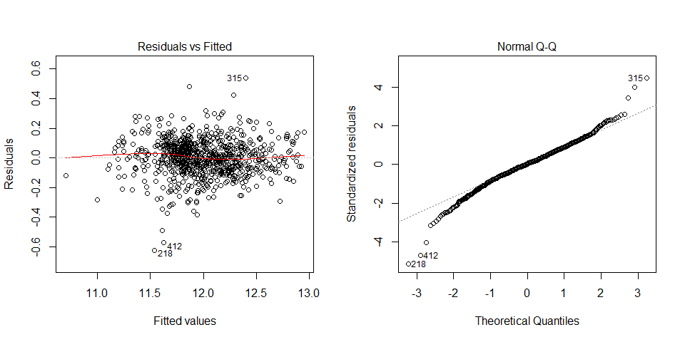

Task Description
================

As a statistical consultant working for a real estate investment firm,
your task is to develop a model to predict the selling price of a given
home in Ames, Iowa. Your employer hopes to use this information to help
assess whether the asking price of a house is higher or lower than the
true value of the house. If the home is undervalued, it may be a good
investment for the firm.

Training Data and relevant packages
===================================

First let's load all the necessary packages.

    library(statsr)
    library(plyr)
    library(dplyr)
    library(BAS)
    library(MASS)
    library(ggplot2)
    library(scales)
    library(reshape)
    library(GGally)

Next, let's load the data. They have been randomly divided into three
separate pieces: a training data set, a testing data set, and a
validation data set. For now we will load the training data set, the
others will be loaded and used later.

    load("ames_train.Rdata")

------------------------------------------------------------------------

Exploratory Data Analysis (EDA)
===============================

In this section we will look at all the variables in the dataset one by
one.

As the 1st step let's only keep the cases with **normal** sales
conditions. The concern is that houses sold in abnormal sale conditions
may not exhibit the same behavior as houses sold in normal sale
conditions. The plot below (taken from the course quiz) shows that this
concern is meaningful. This decreases the training dataset from 1000 to
834 cases.

    n.Sale.Condition = length(levels(ames_train$Sale.Condition))
    par(mar=c(5,4,4,10))
    plot(log(price) ~ I(area), 
         data=ames_train, col=Sale.Condition,
         pch=as.numeric(Sale.Condition)+15, main="Training Data")
    legend(x=,"right", legend=levels(ames_train$Sale.Condition),
           col=1:n.Sale.Condition, pch=15+(1:n.Sale.Condition),
           bty="n", xpd=TRUE, inset=c(-.5,0))

Additionally looking at the variables with the largest number of NA
entries one can see, that only three houses out of 1000 have a pool.
These houses will be removed, and **the model will be restricted to the
houses without pools**.

Additionally the following variables by definition contain additional
information, that is useful in general, but cannot be generalized to be
used as a meaningful variable: `Misc.Feature`, `Misc.Val`, `PID`,
`Condition.1`, `Condition.2` and `Utilities`.

The variable `Yr.Sold` is also removed, as it does not help make
predictions for the future.

    ames_train <- ames_train[ames_train$Sale.Condition=="Normal",] # 1000 => 834
    ames_train <- ames_train[,names(ames_train) != "Sale.Condition"]

    ames_train <- ames_train[is.na(ames_train$Pool.QC),]           # 834 => 831
    ames_train <- ames_train[,names(ames_train) != "Pool.QC"]
    ames_train <- ames_train[,names(ames_train) != "Pool.Area"]

    ames_train <- ames_train[,names(ames_train) != "Misc.Feature"]
    ames_train <- ames_train[,names(ames_train) != "Misc.Val"]
    ames_train <- ames_train[,names(ames_train) != "PID"]
    ames_train <- ames_train[,names(ames_train) != "Condition.1"]
    ames_train <- ames_train[,names(ames_train) != "Condition.2"]
    ames_train <- ames_train[,names(ames_train) != "Utilities"]

    ames_train <- ames_train[,names(ames_train) != "Yr.Sold"]

Now let's look at the remaining variables in the dataset one by one in
the order they appear in the dataset. The full code for this lengthy
part is given in the appendix 1. Results of this part are summarized
below.

The following variables were judged as uninformative and removed from
the dataset:

-   `Street`
-   `Roof.Matl`
-   `Mas.Vnr.Area`
-   `Mas.Vnr.Type`
-   `BsmtFin.Type.2`
-   `BsmtFin.SF.2`
-   `Heating`
-   `Low.Qual.Fin.SF`
-   `Garage.Cond`
-   `Garage.Qual`
-   `X3Ssn.Porch`

The remaining variables are tidied up and sorted into four categories:

-   good\_cat\_var (**24**):
    -   `MS.Zoning`, `Neighborhood`, `Bldg.Type`, `House.Style`,
        `Overall.Cond`, `Overall.Qual`, `Exter.Qual`, `Bsmt.Cond`,
        `Bsmt.Qual`, `Bsmt.Exposure`, `BsmtFin.Type.1`, `Heating.QC`,
        `Central.Air`, `Electrical`, `Bsmt.Bath`, `Bath`,
        `Bedroom.AbvGr`, `Kitchen.AbvGr`, `Kitchen.Qual`, `Fireplaces`,
        `Garage.Type`, `Garage.Finish`, `Garage.Cars`, `Open.Porch.SF`.
-   suspicious\_cat\_var (**20**):
    -   `MS.SubClass`, `Alley`, `Paved.Drive`, `Lot.Shape`,
        `Land.Contour`, `Land.Slope`, `Lot.Config`, `Roof.Style`,
        `Exterior.1st`, `Exterior.2nd`, `Mas.Vnr`, `Exter.Cond`,
        `Foundation`, `Functional`, `Fireplace.Qu`, `Screen.Porch`,
        `Enclosed.Porch`, `Fence`, `Mo.Sold`, `Sale.Type`.
-   good\_cont\_var (**11**):
    -   `area`, `Lot.Frontage`, `Lot.Area`, `Year.Built`,
        `Year.Remod.Add`, `Bsmt.Unf.SF`, `Total.Bsmt.SF`,
        `BsmtFin.SF.1`, `X1st.Flr.SF`, `TotRms.AbvGrd`, `Garage.Area`.
-   suspicious\_cont\_var (**2**):
    -   `Garage.Yr.Blt`, `Wood.Deck.SF`.

Most of the categorical values were revalued because of:

-   empty levels
-   too many levels with only a few entries (as a rule of thumb in this
    project I used n=30 as an appropriate size of a factor level)
-   no-name levels (indeed a couple of variables had levels named
    **""**)
-   NAs in most of the cases in this dataset did not mean *no data
    available*, but rather the absence of a particular feature, thus a
    special dedicated level was assigned to the NA values.

Additionally I have opted to treat the following variables as
categorical:

-   `Mo.Sold`
-   `Bsmt.Bath` and `Bath`
-   `Bedroom.AbvGr`
-   `Kitchen.AbvGr`
-   `Fireplaces`
-   `Garage.Cars`

They all are numeric and could also be treated as continuous variables,
but they only have a very narrow range of values.

For several variables combinations were formed:

-   `X1st.Flr.SF` and `X2nd.Flr.SF` add up to be exactly the `area`
    variable. Thus only two of them should be kept: `area` and
    `X1st.Flr.SF`,

-   for bathrooms in the basement and in the remaining ones full and
    half bathrooms were combined as follows:
    `Full.Bath + 0.5 x Half.Bath`.

For continuous variables histograms provide useful information about
data skewness. Below is an example of the `area` variable: it is right
skewed, thus log-transform should and would be used. Similarly
log-transform will be used for the `price` itself for `Lot.Area` and
`Garage.Area`.

    par(mfrow = c(1, 2))
    hist(ames_train$area,breaks = 30, main="Area")
    hist(log(ames_train$area),breaks = 30,main="Log(Area)")

Histograms also highlight potential outliers. Below is an example of the
`Lot.Area` variable: there are 7 houses with area significantly higher
than 40,000sq.ft. And even log-transform does not help. If kept in the
model these 7 cases might have a significant effect/leverage on the
model. Thus they are removed and **the final model will be restricted on
houses with the Lot.Area below 40,000sq.ft.**

    par(mfrow = c(1, 2))
    hist(ames_train$Lot.Area,breaks = 30, main="Lot.Area")
    hist(log(ames_train$Lot.Area),breaks = 30, main="Log(Lot.Area)")

Finally important insight is given by the pairs plot for the continuous
variables: we can see whether trends between different pairs exist, and
how high covariances are.

The plot below provides us information about the relationship between
the price and the other continuous variables, as well as the
relationships between the variables themselves. Thus we can identify

-   the most valuable variables - `area` in this case and potentially
    `Garage.Area`
-   dependencies between variables - `Total.Bsmt.SF`, `Bsmt.Unf.SF` and
    `BsmtFin.SF.1` seem to have a linear dependency, thus it might be
    wise not to use all of them in the model
-   outliers, that might have a big impact on the model - as in the
    `Lot.Frontage` variable.

**Remark**: the plot below provides a lot of information, but is badly
suited for a report in case of many variables.

With this steps the data are cleaned and we can proceed to the model
creation. For more information about the reasons of removing one or
another variable please refer to the comments in the code in the
appendix 1.

**Summary of the EDA section**:

The model will be restricted to the houses

-   sold under normal conditions
-   without pools
-   with the Lot.Area below 40,000sq.ft and Lot.Frontage below 150 ft.
-   only living, non-commercial / non-agricultural properties

Out of the 80 variables in the original data set only **57** were kept,
they were split into *good* and *suspicious* in order to prioritize
them.

Out of the 1000 observations only 813 remained, due to the restrictions
mentioned above.

For variables `area`, `Lot.Area` and `Garage.Area` as well as for the
`price` itself log-transform will be used, due to the right-skewness of
the data.

Many categorical variables were revalued. Naturally similar
modifications will be done to the testing set and to the validation set
too, once we begin using them.

------------------------------------------------------------------------

Development and assessment of an initial model
==============================================

An Initial Model
----------------

As asked in the task, we will first fit a linear model with at most 10
variables. Based on the categorisation made above these 10 variables
will be the following ones:

-   continuous: `area`, `Lot.Area`, `Garage.Area`, `Year.Built`,
    `TotRms.AbvGrd`
-   categorical: `Bath`, `Neighborhood`, `Overall.Qual`, `Exter.Qual`,
    `Bsmt.Qual`

All of them have been marked as *good* variables. And out of in total 34
good variables, these ones are the most important in my opinion. Of
course my personal opinion is very subjective, and for the final model I
will be selecting the model in an objective matter, but for the first
guess model this is a reasonable starting point.

From the continuous variables the ones reflecting the basement surface
were judged to be secondary with respect to the area variables. From two
year variables only one was taken for the first model.

Five categorical variables were chosen based solely on my personal
priorities, but in general they reflect the overall quality of the
property, neighborhood seems to be a very important factor in the US in
general, and a number of bathrooms should be an important variable.

    init_fit <- lm(log(price) ~ log(area) + log(Lot.Area) + log(Garage.Area+1) + 
                                Year.Built + TotRms.AbvGrd + Bath + 
                                Neighborhood +
                                Overall.Qual + Exter.Qual + Bsmt.Qual,
                  data = ames_train)
    summary(init_fit)   

    ## 
    ## Call:
    ## lm(formula = log(price) ~ log(area) + log(Lot.Area) + log(Garage.Area + 
    ##     1) + Year.Built + TotRms.AbvGrd + Bath + Neighborhood + Overall.Qual + 
    ##     Exter.Qual + Bsmt.Qual, data = ames_train)
    ## 
    ## Residuals:
    ##      Min       1Q   Median       3Q      Max 
    ## -0.63602 -0.06917  0.00255  0.07164  0.56223 
    ## 
    ## Coefficients:
    ##                        Estimate Std. Error t value Pr(>|t|)    
    ## (Intercept)           0.0889717  0.8007755   0.111 0.911560    
    ## log(area)             0.5213992  0.0312265  16.697  < 2e-16 ***
    ## log(Lot.Area)         0.1423214  0.0120133  11.847  < 2e-16 ***
    ## log(Garage.Area + 1)  0.0124674  0.0040149   3.105 0.001970 ** 
    ## Year.Built            0.0035579  0.0003658   9.726  < 2e-16 ***
    ## TotRms.AbvGrd        -0.0106978  0.0052762  -2.028 0.042946 *  
    ## Bath1.5              -0.0419118  0.0153937  -2.723 0.006621 ** 
    ## Bath2                -0.0533528  0.0168390  -3.168 0.001593 ** 
    ## BathMore             -0.0816881  0.0230795  -3.539 0.000425 ***
    ## NeighborhoodBrkSide   0.0272434  0.0291721   0.934 0.350652    
    ## NeighborhoodCollgCr  -0.0575713  0.0226972  -2.536 0.011391 *  
    ## NeighborhoodCrawfor   0.1269220  0.0313670   4.046 5.72e-05 ***
    ## NeighborhoodEdwards  -0.0635382  0.0244034  -2.604 0.009399 ** 
    ## NeighborhoodGilbert  -0.0791135  0.0289172  -2.736 0.006363 ** 
    ## NeighborhoodIDOTRR   -0.0528423  0.0331991  -1.592 0.111863    
    ## NeighborhoodMitchel   0.0020964  0.0260982   0.080 0.935998    
    ## NeighborhoodNAmes     0.0164898  0.0211368   0.780 0.435543    
    ## NeighborhoodNoRidge   0.0313610  0.0306522   1.023 0.306566    
    ## NeighborhoodNridgHt   0.0391536  0.0280143   1.398 0.162623    
    ## NeighborhoodNWAmes   -0.0070347  0.0276014  -0.255 0.798892    
    ## NeighborhoodOldTown  -0.0430591  0.0280730  -1.534 0.125478    
    ## NeighborhoodSawyer   -0.0039747  0.0247391  -0.161 0.872400    
    ## NeighborhoodSawyerW  -0.0915805  0.0264909  -3.457 0.000576 ***
    ## NeighborhoodSomerst   0.0127097  0.0245230   0.518 0.604414    
    ## Overall.QualAvg       0.0938936  0.0183401   5.120 3.86e-07 ***
    ## Overall.QualAboveAvg  0.1665979  0.0200627   8.304 4.44e-16 ***
    ## Overall.QualGood      0.2356197  0.0235666   9.998  < 2e-16 ***
    ## Overall.QualVeryGood  0.3420633  0.0283263  12.076  < 2e-16 ***
    ## Exter.QualTA         -0.2188756  0.0400977  -5.459 6.46e-08 ***
    ## Exter.QualGd         -0.1584790  0.0371555  -4.265 2.24e-05 ***
    ## Bsmt.QualFa          -0.1017254  0.0409704  -2.483 0.013241 *  
    ## Bsmt.QualGd          -0.0737896  0.0236432  -3.121 0.001869 ** 
    ## Bsmt.QualNone        -0.3229250  0.0391494  -8.249 6.81e-16 ***
    ## Bsmt.QualTA          -0.0991204  0.0279723  -3.544 0.000418 ***
    ## ---
    ## Signif. codes:  0 '***' 0.001 '**' 0.01 '*' 0.05 '.' 0.1 ' ' 1
    ## 
    ## Residual standard error: 0.1234 on 779 degrees of freedom
    ## Multiple R-squared:  0.8941, Adjusted R-squared:  0.8897 
    ## F-statistic: 199.4 on 33 and 779 DF,  p-value: < 2.2e-16

As we can see above the first guess turned out to be quite good:

-   overall p-value is 2.2e-16, i.e. the model in general is
    statistically good
-   adjusted R-squared is 0.8898, i.e. we can explain almost 90% of the
    variability in data with this model
-   all continuous variables are statistically significant
-   all categorical values have levels with very significant p-values;
    only `Neighborhood` variable has the majority of the levels with
    quite high p-values, but at least five if them are significant, thus
    this variable is also significant.

As for the coefficients, since we are using the log transform for
several variables as well as for the price, they are not that
straightforward to interpret:

-   **Price depends linearly on the living `area`, `Lot.Area` and
    `Garage.Area`**. The coefficient is a combination of all the
    coefficients of the linear model.

-   **Price depends exponentially on the `Year.Built` and
    `TotRms.AbvGrd`**.

-   Dependency from the 5 categorical variables is also exponential, but
    since they are not continuous the effect is that different levels
    have different multiplicative coefficients in the equation for
    price.

------------------------------------------------------------------------

Model Selection
---------------

Using `BAS` and the initial model fitted above `init_fit` we can try
several model selection methods, namely AIC (k=2), BIC (k=log(n)) and
frequentists p-value approach (k=qchisq(p, 1, lower.tail = F)).

We will be doing backwards elimination in all three cases.

    stepAIC_lm <- stepAIC(init_fit, direction="backward", k=2, trace=FALSE)
    stepAIC_lm$anova

    ## Stepwise Model Path 
    ## Analysis of Deviance Table
    ## 
    ## Initial Model:
    ## log(price) ~ log(area) + log(Lot.Area) + log(Garage.Area + 1) + 
    ##     Year.Built + TotRms.AbvGrd + Bath + Neighborhood + Overall.Qual + 
    ##     Exter.Qual + Bsmt.Qual
    ## 
    ## Final Model:
    ## log(price) ~ log(area) + log(Lot.Area) + log(Garage.Area + 1) + 
    ##     Year.Built + TotRms.AbvGrd + Bath + Neighborhood + Overall.Qual + 
    ##     Exter.Qual + Bsmt.Qual
    ## 
    ## 
    ##   Step Df Deviance Resid. Df Resid. Dev       AIC
    ## 1                        779   11.87005 -3368.317

    stepBIC_lm <- stepAIC(init_fit, direction="backward", k=log(dim(ames_train)[1]), trace=FALSE)
    stepBIC_lm$anova

    ## Stepwise Model Path 
    ## Analysis of Deviance Table
    ## 
    ## Initial Model:
    ## log(price) ~ log(area) + log(Lot.Area) + log(Garage.Area + 1) + 
    ##     Year.Built + TotRms.AbvGrd + Bath + Neighborhood + Overall.Qual + 
    ##     Exter.Qual + Bsmt.Qual
    ## 
    ## Final Model:
    ## log(price) ~ log(area) + log(Lot.Area) + log(Garage.Area + 1) + 
    ##     Year.Built + Bath + Overall.Qual + Exter.Qual + Bsmt.Qual
    ## 
    ## 
    ##              Step Df Deviance Resid. Df Resid. Dev       AIC
    ## 1                                   779   11.87005 -3208.492
    ## 2  - Neighborhood 15 1.390481       794   13.26053 -3218.944
    ## 3 - TotRms.AbvGrd  1 0.058610       795   13.31914 -3222.060

    step__p_lm <- stepAIC(init_fit, direction="backward", k=qchisq(0.05, 1, lower.tail = F), trace=FALSE)
    step__p_lm$anova

    ## Stepwise Model Path 
    ## Analysis of Deviance Table
    ## 
    ## Initial Model:
    ## log(price) ~ log(area) + log(Lot.Area) + log(Garage.Area + 1) + 
    ##     Year.Built + TotRms.AbvGrd + Bath + Neighborhood + Overall.Qual + 
    ##     Exter.Qual + Bsmt.Qual
    ## 
    ## Final Model:
    ## log(price) ~ log(area) + log(Lot.Area) + log(Garage.Area + 1) + 
    ##     Year.Built + TotRms.AbvGrd + Bath + Neighborhood + Overall.Qual + 
    ##     Exter.Qual + Bsmt.Qual
    ## 
    ## 
    ##   Step Df Deviance Resid. Df Resid. Dev       AIC
    ## 1                        779   11.87005 -3305.708

Both AIC and p-values based models show, that original model was already
parsimonious.

But BIC approach arrives at a different model, namely it suggests
removing `Neighborhood` and `TotRms.AbvGrd` from the list of the
predictors. However we see that the change in AIC value due to removing
the above mentioned variables is very small - around 0.5%, i.e. not
significant. And we can say that generally all three approaches agree.

------------------------------------------------------------------------

Initial Model Residuals
-----------------------

Now that we have seen that the `init_fit` model is the best one for the
chosen 10 variables, let's look at the residuals, using the four default
plots.

    par(mfrow = c(1, 2))
    plot(init_fit, which=c(2,1))

We can see that there are no visible trends in residuals; the Q-Q plot
shows that they are very close to being normally distributed. Several
points stand out of the general scatter cloud: `points 218,412,315`;
let's look at them a little bit closer.

    subset <- ames_train[c(218,315,412),]
    subset$Year.Built

    ## [1] 1920 1935 1934

    subset$price

    ## [1]  55000 415000  63000

The three houses in question are marked red on the scatter plot above.
From the data we can see that they are quite old and two of them have a
low price. The model overpredicts the price of the cheaper houses, so we
might need to adjust the model, so that it works better for these
houses.

However if we look at the variable `Year.Built` we can see that it is
right-skewed. A transformation could help.

    par(mfrow = c(1, 2))
    hist(ames_train$Year.Built,breaks = 30, main="Year Built")
    hist(log(2018-ames_train$Year.Built),breaks = 30, main="Log(Age of the House)")

Substituting `Year.Built` in the linear model with
`log(2018-ames_train$Year.Built)`, i.e. log of the house age, we try
fitting the model again and look at the residuals.

    init_fit_2 <- lm(log(price) ~ log(area) + log(Lot.Area) + log(Garage.Area+1) + 
                                  log(2018-Year.Built) + TotRms.AbvGrd + Bath + 
                                  Neighborhood +
                                  Overall.Qual + Exter.Qual + Bsmt.Qual,
                    data = ames_train)
    par(mfrow = c(1, 2))
    plot(init_fit_2, which=c(2,1))

And it does not change much. So the reason for these points to be
outliers is not in the age of the house.

Unfortunately no other explanations/generalisations could be derived
from this subset of three cases. But it definitely makes sense to make a
similar check in the final model.

------------------------------------------------------------------------

Initial Model RMSE
------------------

Now that we have the model, and residuals look good, we can estimate
RMSE.

    train_prediction <- predict(init_fit)
    train_resid <- exp(train_prediction)-ames_train$price

    RSS <- c(crossprod(train_resid))
    MSE <- RSS / length(train_resid)
    RMSE <- sqrt(MSE)
    RMSE

    ## [1] 21764.41

Out 10-variables model has RMSE of approx. 21,750$. This would make
approx. 14% of the price for the median of the house prices. This is not
perfect, RMSE below 10% would be better, but this is still a reasonable
value.

------------------------------------------------------------------------

Overfitting
-----------

Now we can use the testing part of the data set `ames_test`.

    load("ames_test.Rdata")

We repeat here all modifications we have done to the training model. The
full code is given in appendix 2.

And we use our `init_fit` to predict prices of the testing data.

    prices <- as.data.frame(ames_test$price)
    colnames(prices) <- "price"
    prices$init_fit <- exp(predict(init_fit, newdata=ames_test))
    ggplot(data=prices, aes(x = price, y = init_fit)) +
    geom_point() +
    geom_abline(slope=1, intercept=0) +
    theme_minimal() +
    labs(title = "Comparing predictions for the test data", 
         y = "Predicted price", 
         x = "Real price")

    test_prediction <- predict(init_fit, newdata=ames_test)
    test_resid <- exp(test_prediction)-ames_test$price
    plot(test_resid)

The model underpredicts the price of the more expensive houses. Besides
there are a couple of outliers in the residuals plot.

On the closer look it turns out that the outliers are houses that cost
more than 500,000$. All houses in the training set cost less than that,
i.e. now the model is extrapolating, and this is not always a good idea.
Let us remove houses that cost more than 500,000$ from the dataset and
**restrict our model to the houses that are on the market for less than
500,000$**.

    ames_test <- ames_test[ames_test$price<500000,]
    test_prediction <- predict(init_fit, newdata=ames_test)
    test_resid <- exp(test_prediction)-ames_test$price
    plot(test_resid)

    RSS_test <- c(crossprod(test_resid))
    MSE_test <- RSS_test / length(test_resid)
    RMSE_test <- sqrt(MSE_test)
    RMSE_test

    ## [1] 21737.28

The residuals look much more uniform now.

RMSE on the testing set is 21,950$ a little bit higher than on the
training set (1%), but this is not high enough to talk about
overfitting.

**Conclusion: we have created a linear regression model with 10
variables, that accounts for almost 90% of the variability in data. RMSE
on the training data is 21,750$, and on the test data 21,950$, which
makes approx. 15% of the price for the median price value in the
training data set.**

------------------------------------------------------------------------

Development of a Final Model
============================

**TASK**: create a final model with *at most* 20 variables.

Final Model
-----------

Above we have created a linear model with 10 variables, all of which are
statistically significant. We will take this model as a starting point
and add up to 10 more variables. It might happen that in this process we
will re-evaluate the significance of the original 10 variables, but for
the start we will just take them as they are.

We have 57 variables, so we are choosing from 47 now. They were
categorized (subjectively) above to good and suspicious. This could help
us narrow down the choice. Additional information could come from the
`stepAIC` function. We will fit a model using *all the variables* and
then apply stepAIC, this could suggest the choice of the variables for
the first attempt.

    full_fit <- lm(log(price) ~ .,data = ames_train)
    stepAIC_lm_full <- stepAIC(full_fit, direction="backward", k=qchisq(0.05, 1, lower.tail = F), trace=FALSE)
    formula(stepAIC_lm_full)

    ## log(price) ~ area + MS.SubClass + MS.Zoning + Lot.Area + Alley + 
    ##     Neighborhood + Bldg.Type + Overall.Qual + Overall.Cond + 
    ##     Year.Built + Year.Remod.Add + Exterior.1st + Exter.Qual + 
    ##     Bsmt.Exposure + BsmtFin.Type.1 + Bsmt.Unf.SF + Total.Bsmt.SF + 
    ##     Central.Air + Kitchen.AbvGr + Kitchen.Qual + Functional + 
    ##     Fireplaces + Garage.Area + Bsmt.Bath

stepAIC selects 24 variables, that might be of interest. Some of them
were not really prepared for the use in linear regression. For instance
the variable `MS.SubClass` has several levels with as little as 1 entry.

    summary(ames_train$MS.SubClass)

    ##  20  30  40  45  50  60  70  75  80  85  90 120 160 180 190 
    ## 301  41   1   7  79 153  28   6  35  20  26  54  42   6  14

And this is not a fully independent variable: it combines the info of
`House.Style` and `Year.Built`. Thus it is not the optimal choice of a
variable.

This way we arrive at the model with 25 variables.

    fit_25 <- lm(log(price) ~ log(area) + log(Lot.Area) + log(Garage.Area+1) + 
                              Year.Built + TotRms.AbvGrd + Bath +  
                              Neighborhood +
                              Overall.Qual + Exter.Qual + Bsmt.Qual +
                              #adding variables from the AIC of the full model
                              MS.Zoning + Alley + Bldg.Type +  
                              Year.Remod.Add + Exterior.1st + Bsmt.Exposure + 
                              BsmtFin.Type.1 + Bsmt.Unf.SF + Total.Bsmt.SF + 
                              Central.Air + Kitchen.AbvGr + Kitchen.Qual + 
                              Functional + Fireplaces + Bsmt.Bath,
                 data = ames_train)

    summary(fit_25)

    ## 
    ## Call:
    ## lm(formula = log(price) ~ log(area) + log(Lot.Area) + log(Garage.Area + 
    ##     1) + Year.Built + TotRms.AbvGrd + Bath + Neighborhood + Overall.Qual + 
    ##     Exter.Qual + Bsmt.Qual + MS.Zoning + Alley + Bldg.Type + 
    ##     Year.Remod.Add + Exterior.1st + Bsmt.Exposure + BsmtFin.Type.1 + 
    ##     Bsmt.Unf.SF + Total.Bsmt.SF + Central.Air + Kitchen.AbvGr + 
    ##     Kitchen.Qual + Functional + Fireplaces + Bsmt.Bath, data = ames_train)
    ## 
    ## Residuals:
    ##      Min       1Q   Median       3Q      Max 
    ## -0.40630 -0.05271  0.00371  0.05451  0.42805 
    ## 
    ## Coefficients: (2 not defined because of singularities)
    ##                        Estimate Std. Error t value Pr(>|t|)    
    ## (Intercept)           1.855e-01  8.712e-01   0.213 0.831483    
    ## log(area)             4.022e-01  2.779e-02  14.470  < 2e-16 ***
    ## log(Lot.Area)         7.753e-02  1.335e-02   5.808 9.39e-09 ***
    ## log(Garage.Area + 1)  1.182e-02  3.229e-03   3.661 0.000269 ***
    ## Year.Built            1.996e-03  3.352e-04   5.954 4.03e-09 ***
    ## TotRms.AbvGrd         4.794e-03  4.671e-03   1.026 0.305072    
    ## Bath1.5              -9.200e-03  1.247e-02  -0.738 0.460780    
    ## Bath2                -2.129e-02  1.424e-02  -1.495 0.135411    
    ## BathMore             -3.209e-04  1.995e-02  -0.016 0.987171    
    ## NeighborhoodBrkSide   2.123e-02  2.601e-02   0.816 0.414675    
    ## NeighborhoodCollgCr  -4.385e-02  1.931e-02  -2.270 0.023470 *  
    ## NeighborhoodCrawfor   9.563e-02  2.543e-02   3.761 0.000183 ***
    ## NeighborhoodEdwards  -6.169e-02  2.009e-02  -3.071 0.002211 ** 
    ## NeighborhoodGilbert  -6.687e-02  2.363e-02  -2.829 0.004789 ** 
    ## NeighborhoodIDOTRR    5.781e-04  3.047e-02   0.019 0.984867    
    ## NeighborhoodMitchel  -1.913e-02  2.103e-02  -0.910 0.363360    
    ## NeighborhoodNAmes    -3.058e-02  1.776e-02  -1.722 0.085468 .  
    ## NeighborhoodNoRidge   2.112e-02  2.512e-02   0.841 0.400637    
    ## NeighborhoodNridgHt   1.846e-02  2.280e-02   0.810 0.418414    
    ## NeighborhoodNWAmes   -4.107e-02  2.255e-02  -1.821 0.069008 .  
    ## NeighborhoodOldTown  -2.245e-02  2.677e-02  -0.838 0.402080    
    ## NeighborhoodSawyer   -2.773e-02  2.010e-02  -1.380 0.168091    
    ## NeighborhoodSawyerW  -7.586e-02  2.169e-02  -3.497 0.000498 ***
    ## NeighborhoodSomerst   1.027e-02  3.418e-02   0.300 0.763970    
    ## Overall.QualAvg       6.130e-02  1.490e-02   4.114 4.33e-05 ***
    ## Overall.QualAboveAvg  1.110e-01  1.701e-02   6.524 1.27e-10 ***
    ## Overall.QualGood      1.617e-01  2.014e-02   8.029 3.85e-15 ***
    ## Overall.QualVeryGood  2.231e-01  2.422e-02   9.212  < 2e-16 ***
    ## Exter.QualTA         -1.027e-01  3.456e-02  -2.972 0.003053 ** 
    ## Exter.QualGd         -7.495e-02  3.248e-02  -2.308 0.021300 *  
    ## Bsmt.QualFa          -2.154e-02  3.374e-02  -0.638 0.523461    
    ## Bsmt.QualGd          -3.115e-02  1.928e-02  -1.616 0.106613    
    ## Bsmt.QualNone        -1.665e-01  3.879e-02  -4.293 2.00e-05 ***
    ## Bsmt.QualTA          -3.649e-02  2.288e-02  -1.595 0.111150    
    ## MS.ZoningRM          -2.747e-02  3.962e-02  -0.693 0.488315    
    ## MS.ZoningRL           1.495e-02  3.737e-02   0.400 0.689266    
    ## AlleyNoAl             1.292e-03  2.363e-02   0.055 0.956431    
    ## AlleyPave             8.046e-02  3.230e-02   2.491 0.012957 *  
    ## Bldg.TypeDuplex      -3.973e-02  2.932e-02  -1.355 0.175770    
    ## Bldg.TypeTwnhs       -8.081e-02  2.794e-02  -2.893 0.003932 ** 
    ## Bldg.TypeTwnhsE      -2.246e-02  2.029e-02  -1.107 0.268528    
    ## Year.Remod.Add        1.989e-03  2.621e-04   7.589 9.70e-14 ***
    ## Exterior.1stBrkComm   3.844e-01  1.065e-01   3.608 0.000329 ***
    ## Exterior.1stBrkFace   1.659e-01  4.028e-02   4.118 4.25e-05 ***
    ## Exterior.1stCemntBd   4.191e-02  4.164e-02   1.007 0.314457    
    ## Exterior.1stHdBoard   6.560e-02  3.725e-02   1.761 0.078600 .  
    ## Exterior.1stImStucc   4.829e-02  1.043e-01   0.463 0.643631    
    ## Exterior.1stMetalSd   9.002e-02  3.622e-02   2.485 0.013159 *  
    ## Exterior.1stPlywood   5.317e-02  3.863e-02   1.376 0.169132    
    ## Exterior.1stStucco    9.652e-02  4.325e-02   2.231 0.025950 *  
    ## Exterior.1stVinylSd   5.770e-02  3.698e-02   1.560 0.119115    
    ## Exterior.1stWd Sdng   9.761e-02  3.656e-02   2.670 0.007756 ** 
    ## Exterior.1stWdShing   9.012e-02  4.281e-02   2.105 0.035614 *  
    ## Bsmt.ExposureGd       2.731e-02  1.578e-02   1.731 0.083817 .  
    ## Bsmt.ExposureMn      -3.787e-02  1.486e-02  -2.549 0.011012 *  
    ## Bsmt.ExposureNo      -1.865e-02  1.089e-02  -1.713 0.087131 .  
    ## Bsmt.ExposureNone            NA         NA      NA       NA    
    ## BsmtFin.Type.1BLQ    -3.714e-02  1.414e-02  -2.626 0.008810 ** 
    ## BsmtFin.Type.1GLQ    -1.136e-03  1.241e-02  -0.091 0.927132    
    ## BsmtFin.Type.1LwQ    -9.130e-02  1.724e-02  -5.295 1.57e-07 ***
    ## BsmtFin.Type.1None           NA         NA      NA       NA    
    ## BsmtFin.Type.1Rec    -4.373e-02  1.394e-02  -3.137 0.001775 ** 
    ## BsmtFin.Type.1Unf    -5.015e-02  1.459e-02  -3.436 0.000623 ***
    ## Bsmt.Unf.SF          -5.047e-05  1.597e-05  -3.160 0.001643 ** 
    ## Total.Bsmt.SF         1.228e-04  1.896e-05   6.477 1.70e-10 ***
    ## Central.AirY          1.367e-01  1.923e-02   7.110 2.73e-12 ***
    ## Kitchen.AbvGr2        2.872e-02  3.649e-02   0.787 0.431544    
    ## Kitchen.QualTA       -1.102e-01  2.457e-02  -4.485 8.44e-06 ***
    ## Kitchen.QualGd       -7.555e-02  2.287e-02  -3.304 0.001000 ***
    ## FunctionalTyp         6.736e-02  1.548e-02   4.351 1.55e-05 ***
    ## Fireplaces1           2.406e-02  8.935e-03   2.693 0.007236 ** 
    ## Fireplaces2           5.286e-02  1.565e-02   3.377 0.000771 ***
    ## Bsmt.Bath0.5          2.086e-02  1.621e-02   1.286 0.198729    
    ## Bsmt.Bath1            3.052e-02  1.015e-02   3.008 0.002720 ** 
    ## ---
    ## Signif. codes:  0 '***' 0.001 '**' 0.01 '*' 0.05 '.' 0.1 ' ' 1
    ## 
    ## Residual standard error: 0.09444 on 741 degrees of freedom
    ## Multiple R-squared:  0.9411, Adjusted R-squared:  0.9354 
    ## F-statistic: 166.6 on 71 and 741 DF,  p-value: < 2.2e-16

Adjusted R2 has increased to 0.94, but we can see that `MS.Zoning`,
`Bath` and `TotRms.AbvGrd` are not statistically significant in this
model. Additionally we see some NAs in `BsmtFin.Type.1` and
`Bsmt.Exposure`. Let's look into it.

    summary(ames_train$BsmtFin.Type.1)

    ##  ALQ  BLQ  GLQ  LwQ None  Rec  Unf 
    ##  139   78  232   45   20   88  211

    summary(ames_train$Bsmt.Exposure)

    ##   Av   Gd   Mn   No None 
    ##  126   66   70  531   20

There is a problem with the case, where the house has no basement. We
could try using a boolean variable for denoting houses with and without
basement, and the same for the garage might make sense too.

Doing this and using backwards elimination we arrive at the following
final model with 19 variables.

    ames_train$garage   <- ifelse(ames_train$Garage.Area>0, TRUE, FALSE)
    ames_train$basement <- ifelse(ames_train$BsmtFin.SF.1 >0, TRUE, FALSE)

    fit_19 <- lm(log(price) ~ log(area) + log(Lot.Area) + log(Garage.Area+1) + 
                              Year.Built + Year.Remod.Add +
                              Neighborhood + MS.Zoning +
                              Overall.Qual + Overall.Cond + 
                              Exter.Qual + Kitchen.Qual + 
                              House.Style + Functional + 
                              Bsmt.Unf.SF + Total.Bsmt.SF + 
                              Central.Air + Bsmt.Bath + 
                              garage + Fireplaces,
                 data = ames_train)
    summary(fit_19)

    ## 
    ## Call:
    ## lm(formula = log(price) ~ log(area) + log(Lot.Area) + log(Garage.Area + 
    ##     1) + Year.Built + Year.Remod.Add + Neighborhood + MS.Zoning + 
    ##     Overall.Qual + Overall.Cond + Exter.Qual + Kitchen.Qual + 
    ##     House.Style + Functional + Bsmt.Unf.SF + Total.Bsmt.SF + 
    ##     Central.Air + Bsmt.Bath + garage + Fireplaces, data = ames_train)
    ## 
    ## Residuals:
    ##      Min       1Q   Median       3Q      Max 
    ## -0.32868 -0.05318  0.00042  0.05373  0.47663 
    ## 
    ## Coefficients:
    ##                        Estimate Std. Error t value Pr(>|t|)    
    ## (Intercept)           9.106e-01  7.040e-01   1.294 0.196215    
    ## log(area)             4.236e-01  2.221e-02  19.076  < 2e-16 ***
    ## log(Lot.Area)         9.160e-02  1.049e-02   8.735  < 2e-16 ***
    ## log(Garage.Area + 1)  4.977e-02  1.223e-02   4.069 5.22e-05 ***
    ## Year.Built            2.372e-03  2.946e-04   8.050 3.15e-15 ***
    ## Year.Remod.Add        1.100e-03  2.640e-04   4.165 3.47e-05 ***
    ## NeighborhoodBrkSide   4.688e-02  2.321e-02   2.020 0.043740 *  
    ## NeighborhoodCollgCr  -3.827e-02  1.749e-02  -2.189 0.028924 *  
    ## NeighborhoodCrawfor   9.622e-02  2.390e-02   4.027 6.22e-05 ***
    ## NeighborhoodEdwards  -6.338e-02  1.836e-02  -3.452 0.000587 ***
    ## NeighborhoodGilbert  -3.361e-02  2.178e-02  -1.544 0.123108    
    ## NeighborhoodIDOTRR    2.190e-02  2.806e-02   0.781 0.435280    
    ## NeighborhoodMitchel  -1.729e-02  1.998e-02  -0.865 0.387130    
    ## NeighborhoodNAmes    -2.468e-02  1.557e-02  -1.585 0.113425    
    ## NeighborhoodNoRidge   1.491e-02  2.331e-02   0.640 0.522409    
    ## NeighborhoodNridgHt   1.588e-02  2.149e-02   0.739 0.460265    
    ## NeighborhoodNWAmes   -7.014e-02  2.117e-02  -3.314 0.000964 ***
    ## NeighborhoodOldTown  -1.981e-02  2.300e-02  -0.861 0.389311    
    ## NeighborhoodSawyer   -2.775e-02  1.830e-02  -1.516 0.129817    
    ## NeighborhoodSawyerW  -7.617e-02  2.017e-02  -3.777 0.000171 ***
    ## NeighborhoodSomerst   1.068e-02  3.269e-02   0.327 0.743940    
    ## MS.ZoningRM          -9.612e-02  3.608e-02  -2.664 0.007876 ** 
    ## MS.ZoningRL          -3.617e-02  3.466e-02  -1.044 0.296994    
    ## Overall.QualAvg       4.933e-02  1.445e-02   3.413 0.000676 ***
    ## Overall.QualAboveAvg  9.875e-02  1.581e-02   6.246 6.99e-10 ***
    ## Overall.QualGood      1.637e-01  1.838e-02   8.906  < 2e-16 ***
    ## Overall.QualVeryGood  2.418e-01  2.220e-02  10.888  < 2e-16 ***
    ## Overall.CondAvg       8.964e-02  1.791e-02   5.006 6.89e-07 ***
    ## Overall.CondAboveAvg  1.250e-01  1.848e-02   6.762 2.71e-11 ***
    ## Overall.CondGood      1.813e-01  1.971e-02   9.199  < 2e-16 ***
    ## Overall.CondVeryGood  2.083e-01  2.323e-02   8.968  < 2e-16 ***
    ## Exter.QualTA         -1.265e-01  3.245e-02  -3.900 0.000105 ***
    ## Exter.QualGd         -9.582e-02  3.006e-02  -3.188 0.001491 ** 
    ## Kitchen.QualTA       -9.853e-02  2.343e-02  -4.205 2.92e-05 ***
    ## Kitchen.QualGd       -7.073e-02  2.168e-02  -3.263 0.001152 ** 
    ## House.Style1Story     1.247e-02  1.486e-02   0.839 0.401493    
    ## House.Style2Story     1.004e-02  1.432e-02   0.701 0.483519    
    ## House.StyleSplit      4.054e-02  1.872e-02   2.166 0.030602 *  
    ## FunctionalTyp         6.458e-02  1.479e-02   4.367 1.43e-05 ***
    ## Bsmt.Unf.SF          -6.907e-05  1.221e-05  -5.657 2.18e-08 ***
    ## Total.Bsmt.SF         1.596e-04  1.678e-05   9.514  < 2e-16 ***
    ## Central.AirY          7.594e-02  1.808e-02   4.199 2.99e-05 ***
    ## Bsmt.Bath0.5          2.322e-02  1.577e-02   1.473 0.141271    
    ## Bsmt.Bath1            3.798e-02  9.557e-03   3.974 7.72e-05 ***
    ## garageTRUE           -2.270e-01  7.278e-02  -3.119 0.001885 ** 
    ## Fireplaces1           2.744e-02  8.532e-03   3.217 0.001352 ** 
    ## Fireplaces2           4.343e-02  1.490e-02   2.914 0.003669 ** 
    ## ---
    ## Signif. codes:  0 '***' 0.001 '**' 0.01 '*' 0.05 '.' 0.1 ' ' 1
    ## 
    ## Residual standard error: 0.09283 on 766 degrees of freedom
    ## Multiple R-squared:  0.9411, Adjusted R-squared:  0.9376 
    ## F-statistic: 266.3 on 46 and 766 DF,  p-value: < 2.2e-16

This is a good model, with adj.R2 = 0.9376 and all variables are
valuable. We can also have a look at the residuals plots.

    par(mfrow = c(1, 2))
    plot(fit_19, which=c(2,1))

Residuals look random, no visible pattern, the points in the Q-Q plot
fall nicely on to the line. There are some outliers, but looking at the
three noted in the plot no trends could be found. It could be that the
price of the cheaper houses is overpredicted.

We could try adding an interaction to mitigate this observation. We have
seen on the ggpairs plot that `area` has the highest correlation with
`price`. We could try increase its effect. Below is the best model with
such a combination. All tested interactions are commented out, but left
there to show the ideas that were tried.

    fit_20 <- lm(log(price) ~ sqrt(area) + log(Lot.Area) + log(Garage.Area+1) + 
                              Year.Built +   
                              Neighborhood +
                              Overall.Qual + Exter.Qual + 
                              # now add all from the AIC of the full model
                              MS.Zoning+
                              Year.Remod.Add + Overall.Cond +
                              Bsmt.Unf.SF + Total.Bsmt.SF + 
                              Central.Air + Kitchen.Qual + 
                              garage + 
                              Functional + Fireplaces + Bsmt.Bath +
                              # added interaction
                              # Total.Bsmt.SF*TotRms.AbvGrd,
                              # log(Garage.Area+1)*log(area) ,
                              # log(2018-Year.Built)*log(area),
                              log(Lot.Frontage+1)*sqrt(area),
                 data = ames_train)
    summary(fit_20)$adj.r.squared

    ## [1] 0.9394553

This last model is a little bit better, than the one without
interaction: adj.R2 has increased from 0.9376 to 0.9395: partly due to
the interaction, partly because `sqrt(area)` has a higher p-value than
`log(area)`. But this increase is very small, and it makes the model
unnecessarily complicated, whereas the task is to create a model, that
could be understood and interpreted easily. Thus the final model will be
the one without interaction, i.e. the one with 19 variables.

    final_lm <- fit_19

------------------------------------------------------------------------

Transformation
--------------

As mentioned in the EDA section the following variables were
log-transformed: `price`, `Lot.Area` and `Garage.Area`. The reason for
doing it is that all of them are right skewed. The EDA section also has
a plot to illustrate, how the log-transform improved the values
distribution.

In the choice of the final model above it was mentioned that
`sqrt(area)` performs a little bit better than `log(area)`. However the
difference is too small to incorporate it into the model. The difference
between the two cases is that in the `sqrt` case the price would depend
exponentially on the area, and in the `log` case the dependency is
linear.

------------------------------------------------------------------------

Variable Interaction
--------------------

As described above the following interactions were added to the model:

-   `Total.Bsmt.SF*TotRms.AbvGrd`
-   `log(Garage.Area+1)*log(area)`
-   `log(2018-Year.Built)*log(area)`
-   `log(Lot.Frontage+1)*sqrt(area)`

The aim was to make the model predict better for the extreme prices.
None of the above mentioned interactions brought significant improvement
to the model. However interactions bring complexity and the risk of
overfitting the model also increases. Thus it was decided to not use
interactions in the final model.

------------------------------------------------------------------------

Variable Selection
------------------

The detailed process of the model selection is given in the section
*Final Model* and is as follows:

-   In the linear model with 10 variables all variables were
    statistically significant. This model was taken as a starting point.

-   Additionally at the EDA stage all variables were categorized
    (subjectively) to good and suspicious -- this helped narrow down the
    choice.

-   On top of it additional information came from the `stepAIC` function
    applied to a linear model with all the variables.

-   In this process two new boolean variables were created: `garage` and
    `basement`.

-   At the end backwards elimination was used to create a parsimonious
    model.

------------------------------------------------------------------------

Model Testing
-------------

The RMSE of the final model on the training and testing sets was
calculated.

    train_pred__20 <- predict(final_lm)
    train_resid_20 <- exp(train_pred__20)-ames_train$price

    RSS_final_train <- c(crossprod(train_resid_20))
    MSE_final_train <- RSS_final_train / length(train_resid_20)
    RMSE_final_train <- sqrt(MSE_final_train)
    RMSE_final_train

    ## [1] 16409.82

    ames_test$garage <- ifelse(ames_test$Garage.Area>0, TRUE, FALSE)
    test_pred__20 <- predict(final_lm, newdata=ames_test)
    test_resid_20 <- exp(test_pred__20)-ames_test$price

    RSS_final_test <- c(crossprod(test_resid_20))
    MSE_final_test <- RSS_final_test / length(test_resid_20)
    RMSE_final_test <- sqrt(MSE_final_test)
    RMSE_final_test

    ## [1] 16569.15

The RMSE of the final model is 16,410$ -- significantly less than the
RMSE of the original 10-variables model. It now makes only 10% of the
median price in the training dataset.

The RMSE on the test data is higher -- 16,570$, i.e. 1% higher than on
the training set. This is not high and is to be expected, that the
testing data do not fit that well. However 1% difference also does not
mean overfitting.

------------------------------------------------------------------------

Final Model Assessment
======================

Final Model Residual
--------------------

Below the the formula of the final model: 19 variables are used in this
model, all of them are statistically significant (the summary of the
model was given in the section 5.1).

    formula(final_lm)

    ## log(price) ~ log(area) + log(Lot.Area) + log(Garage.Area + 1) + 
    ##     Year.Built + Year.Remod.Add + Neighborhood + MS.Zoning + 
    ##     Overall.Qual + Overall.Cond + Exter.Qual + Kitchen.Qual + 
    ##     House.Style + Functional + Bsmt.Unf.SF + Total.Bsmt.SF + 
    ##     Central.Air + Bsmt.Bath + garage + Fireplaces

    par(mfrow = c(1, 2))
    plot(final_lm, which=c(2,1))

Residuals look random, no visible pattern, the points in the Q-Q plot
fall nicely on to the line. There are some outliers, but looking at the
three noted in the plot no trends could be found. It could be that the
price of the cheaper houses is overpredicted.

------------------------------------------------------------------------

Final Model RMSE
----------------

The RMSE of the final model was calculated earlier:

    RMSE_final_train

    ## [1] 16409.82

    RMSE_final_test

    ## [1] 16569.15

The RMSE of the final model is 16,410$ – significantly less than the
RMSE of the original 10-variables model. It now makes only 10% of the
median price in the training dataset.

The RMSE on the test data is higher – 16,570$, i.e. 1% higher than on
the training set. This is not high and is to be expected, that the
testing data do not fit that well. However 1% difference also does not
mean overfitting.

------------------------------------------------------------------------

Final Model Evaluation
----------------------

The created model has several restrictions. It can be used only for the
houses

-   sold under normal conditions
-   without pools
-   with the Lot.Area below 40,000sq.ft and Lot.Frontage below 150 ft.
-   only living, non-commercial / non-agricultural properties
-   price below 500,000$

This restriction if the main weakness of the model.

As for the strength: the aim was to have an interpretable model and this
aim was achieved. 19 variables used in the model account for different
criteria and none of them is counterintuitive: we have house area and
age in, house style and neighbourhood, garage and several `qual`
variables.

From the model we can see that the `price` depends linearly on the
living `area`, `Lot.Area` and `Garage.Area`. The coefficient is a
combination of all the coefficients of the linear model.

It depends exponentially on the `Year.Built`, `Year.Remod.Add`,
`Bsmt.Unf.SF` and `Total.Bsmt.SF`. Although due to a very small
coefficient this dependency is not very pronounced.

Dependency from the categorical variables is also exponential, but since
they are not continuous the effect is that different levels have
different multiplicative coefficients in the equation for price.

------------------------------------------------------------------------

Final Model Validation
----------------------

Finally the final model is tested on a separate, validation data set--
`ames_validation` dataset.

    load("ames_validation.Rdata")

As previously for the test data we have to repeat the EDA steps for the
validation data too. The code is identical to that of the test data,
thus it is not repeated here.

Again we calculate RMSE on the validation data.

    validation_prediction <- predict(final_lm, newdata=ames_validation)
    validation_resid      <- exp(validation_prediction)-ames_validation$price

    RSS_final_validation  <- c(crossprod(validation_resid))
    MSE_final_validation  <- RSS_final_validation / length(validation_resid)
    RMSE_final_validation <- sqrt(MSE_final_validation)
    RMSE_final_validation

    ## [1] 17881.51

The RMSE is significantly higher than that on the training and testing
sets. If we look at the residuals there is one point that has residuals
of approx. -170,000$.

    plot(validation_resid)

If we remove it, the RMSE will be comparable with the RMSE on the
training and testing datasets.

    ames_validation_185   <- ames_validation[-185,]
    validation_prediction <- predict(final_lm, newdata=ames_validation_185)
    validation_resid      <- exp(validation_prediction)-ames_validation_185$price

    RSS_final_validation  <- c(crossprod(validation_resid))
    MSE_final_validation  <- RSS_final_validation / length(validation_resid)
    RMSE_final_validation <- sqrt(MSE_final_validation)
    RMSE_final_validation

    ## [1] 16747.26

So this one point had a huge influence on the RMSE. Looking at the
different plots of the `ames_validation` data, one can clearly see that
the house, that was causing the RMSE is an outlier, that has quite
different properties than those of the other houses.

    par(mfrow = c(2, 2))
    plot(ames_validation$price~ames_validation$area, 
         col=ifelse(ames_validation$price==475000, "red", "black"),
         pch=ifelse(ames_validation$price==475000, 19, 1))
    plot(ames_validation$price~ames_validation$Year.Built, 
         col=ifelse(ames_validation$price==475000, "red", "black"),
         pch=ifelse(ames_validation$price==475000, 19, 1))
    plot(ames_validation$price~ames_validation$BsmtFin.SF.1, 
         col=ifelse(ames_validation$price==475000, "red", "black"),
         pch=ifelse(ames_validation$price==475000, 19, 1))
    plot(ames_validation$price~ames_validation$Bsmt.Unf.SF, 
         col=ifelse(ames_validation$price==475000, "red", "black"),
         pch=ifelse(ames_validation$price==475000, 19, 1))

Our model would fail to be profitable on this kind of property. But on
the rest of the validation set it performed well. In fact all three RMSE
values are pretty close to one another:

-   `RMSE_train = 16,410$`
-   `RMSE_test  = 16,570$`
-   `RMSE_valid = 16,750$`

Finally, to assess how well our model reflects uncertainty we will
determine its coverage probability.

    predict.full <- exp(predict(final_lm, ames_validation, interval = "prediction"))
    coverage.prob.full <- mean(ames_validation$price > predict.full[,"lwr"] &
                               ames_validation$price < predict.full[,"upr"])
    coverage.prob.full

    ## [1] 0.9453333

The coverage probability of 0.945 is quite close to the assumed one of
95%, thus our model is neither conservative, nor permissive.

------------------------------------------------------------------------

Conclusion
==========

A multiple linear regression model was developed to predict the selling
price of a given home in Ames, Iowa. 19 out of the original 80 variables
were used in the model.

The model is restricted to the houses that

-   were sold under normal conditions
-   without pools
-   with the Lot.Area below 40,000sq.ft and Lot.Frontage below 150 ft.
-   only living, non-commercial / non-agricultural properties
-   price below 500,000$

The model should also not be used on atypical houses, that have
significantly different characteristics, than the majority of the houses
in the data used for the model creation.

In this model `price` depends linearly on the living `area`, `Lot.Area`
and `Garage.Area`; exponentially on the `Year.Built`, `Year.Remod.Add`,
`Bsmt.Unf.SF` and `Total.Bsmt.SF`; and the effect of the following
variables is given by additional multiplicative coefficients --
`Neighborhood`, `MS.Zoning`, `Overall.Qual`, `Overall.Cond`,
`Exter.Qual`, `Kitchen.Qual`, `House.Style`, `Functional`,
`Central.Air`, `Bsmt.Bath`, `Fireplaces` and `garage` (a new variable
with TRUE/FALSE entries for the garage availability).

The model has been tested and validated and has shown to perform
similarly on all sets.

The model underpredicts the prices of the expensive houses. From the
investment point of view, this is not acceptable, because for such
houses the real profit would be higher than predicted.

The RMSE is approx. 16,500$, which makes around 10% of the price for the
median price of the houses.

------------------------------------------------------------------------

Appendix: Full EDA Code - training
==================================

    load("ames_train.Rdata")

    #let's go one by one over the variables

    class(ames_train$MS.SubClass)
    ames_train$MS.SubClass <- factor(ames_train$MS.SubClass)
    summary(ames_train$MS.SubClass)
    # needs refactoring, so that there would be no levels with less than e.g. 30 entries
    # alternatively not use this variable as it seems to be a combiunation of House.Style and Year.Built
    # mark as suspicious
    suspicious_cat_var <- c("MS.SubClass")

    summary(ames_train$MS.Zoning)
    # remove commercial and agricultural properties, 6 of them, i.e. 831 -> 825
    ames_train <- ames_train[ames_train$MS.Zoning!="C (all)",]
    ames_train <- ames_train[ames_train$MS.Zoning!="I (all)",]
    ames_train <- ames_train[ames_train$MS.Zoning!="A (agr)",]
    summary(ames_train$MS.Zoning)
    plot(ames_train$price ~ ames_train$MS.Zoning)
    # RH has only 6 entries and is not too different from RM => combine
    ames_train$MS.Zoning <- revalue(ames_train$MS.Zoning,c("RH"="RM"))
    ames_train$MS.Zoning <- factor(ames_train$MS.Zoning)
    good_cat_var <- c("MS.Zoning")

    # for all categorical values summary function and boxplot 
    # of the variables vs price give info about each level
    # it helps understand, what levels could be grouped together
    # and whether a significant difference exist between levels
    # if the difference is insignificant, the variable might not 
    # be very valuable for the model

    summary(ames_train$Lot.Frontage)
    # NA in frontage means 0
    ames_train[is.na(ames_train$Lot.Frontage),names(ames_train) == "Lot.Frontage"] <- 0
    summary(ames_train$Lot.Area)
    good_cont_var <- c("area","Lot.Frontage", "Lot.Area")

    summary(ames_train$Street)
    # not too much info, remove
    ames_train <- ames_train[,names(ames_train) != "Street"]

    summary(ames_train$Alley)
    ames_train$Alley <- as.character(ames_train$Alley)
    ames_train[is.na(ames_train$Alley),names(ames_train) == "Alley"] <- "NoAl"
    ames_train$Alley <- factor(ames_train$Alley)
    summary(ames_train$Alley)
    summary(ames_train$Paved.Drive)
    # alley and paved.drive might be related
    mytable <- xtabs(~Alley + Paved.Drive, data=ames_train)
    summary(mytable)
    # will keep both for now, but if at all use only one in the model
    suspicious_cat_var <- c(suspicious_cat_var,"Alley","Paved.Drive")

    summary(ames_train$Lot.Shape)
    ames_train$Lot.Shape <- revalue(ames_train$Lot.Shape,
                                   c("IR1"="Irr","IR2"="Irr","IR3"="Irr"))
    summary(ames_train$Lot.Shape)

    summary(ames_train$Land.Contour)
    plot(ames_train$price~ames_train$Land.Contour)

    summary(ames_train$Land.Slope)
    ames_train$Land.Slope <- revalue(ames_train$Land.Slope, c("Mod"="Other","Sev"="Other"))
    summary(ames_train$Land.Slope)

    summary(ames_train$Lot.Config)
    plot(ames_train$price~ames_train$Lot.Config)
    ames_train$Lot.Config <- revalue(ames_train$Lot.Config, 
                                     c("FR2"="Frontage", "FR3"="Frontage"))
    summary(ames_train$Lot.Config)

    # after some cleaning all four vairables look good enough to use them
    # but Land.Contour and Land.Slope have one category that has over 80% of properties
    # thus I would not use them at the start 
    # Lot.Shape is not bad, but also not for the first run
    # Lot.Config is also not that different judging from the box plot
    # add all for to susp
    suspicious_cat_var <- c(suspicious_cat_var,"Lot.Shape","Land.Contour",
                            "Land.Slope","Lot.Config")

    summary(ames_train$Neighborhood)
    # refactor Neighborhood by merging all under 20 into "Other"
    ames_train$Neighborhood <- revalue(ames_train$Neighborhood, c("Blmngtn"="Other", "Blueste"="Other", 
                                                                  "BrDale"="Other","ClearCr"="Other",
                                                                  "Greens"="Other","GrnHill"="Other",
                                                                  "MeadowV"="Other","NPkVill"="Other",
                                                                  "StoneBr"="Other","SWISU"="Other",
                                                                  "Timber"="Other","Veenker"="Other",
                                                                  "Landmrk"="Other"))
    summary(ames_train$Neighborhood)
    good_cat_var <- c(good_cat_var, "Neighborhood")

    summary(ames_train$Bldg.Type)
    plot(ames_train$price~ames_train$Bldg.Type)
    # add 2fmCon to Duplex
    ames_train$Bldg.Type <- revalue(ames_train$Bldg.Type, c("2fmCon"="Duplex"))
    summary(ames_train$Bldg.Type)

    summary(ames_train$House.Style)
    plot(ames_train$price~ames_train$House.Style)
    ames_train$House.Style <- revalue(ames_train$House.Style, c("1.5Fin"="1.5St", "1.5Unf"="1.5St", 
                                                                "2.5Unf"="2Story", "SFoyer" = "Split",
                                                                "SLvl"="Split", "2.5Fin"="2Story"))
    summary(ames_train$House.Style)
    good_cat_var <- c(good_cat_var, "Bldg.Type","House.Style")

    class(ames_train$Overall.Cond)
    ames_train$Overall.Cond <- factor(ames_train$Overall.Cond)
    summary(ames_train$Overall.Cond)
    ames_train$Overall.Cond <- revalue(ames_train$Overall.Cond, c("1"="BelowAvg", "2"="BelowAvg", 
                                                                  "3"="BelowAvg", "4"="BelowAvg", 
                                                                  "5"="Avg", "6" = "AboveAvg",
                                                                  "7"="Good", "8"="VeryGood",
                                                                  "9"="VeryGood","10"="VeryGood"))
    summary(ames_train$Overall.Cond)

    class(ames_train$Overall.Qual)
    ames_train$Overall.Qual <- factor(ames_train$Overall.Qual)
    summary(ames_train$Overall.Qual)
    ames_train$Overall.Qual <- revalue(ames_train$Overall.Qual, c("1"="BelowAvg", "2"="BelowAvg", 
                                                                  "3"="BelowAvg", "4"="BelowAvg", 
                                                                  "5"="Avg", "6" = "AboveAvg",
                                                                  "7"="Good", "8"="VeryGood",
                                                                  "9"="VeryGood", "10"="VeryGood"))
    summary(ames_train$Overall.Qual)

    good_cat_var <- c(good_cat_var, "Overall.Cond","Overall.Qual")

    summary(ames_train$Year.Built)
    summary(ames_train$Year.Remod.Add)
    hist(ames_train$Year.Built)
    # good variables
    # year.built is left skewed so a transformation might be helpful

    good_cont_var <- c(good_cont_var,"Year.Built","Year.Remod.Add")

    summary(ames_train$Roof.Style)
    plot(ames_train$price~ ames_train$Roof.Style)
    ames_train$Roof.Style <- revalue(ames_train$Roof.Style, 
                                     c("Flat"="Other", "Gambrel"="Other",
                                       "Mansard"="Other","Shed"="Other"))
    summary(ames_train$Roof.Style)
    # remove potentially as no sign.diff.

    summary(ames_train$Roof.Matl)
    ames_train <- ames_train[,names(ames_train) != "Roof.Matl"]

    suspicious_cat_var <- c(suspicious_cat_var,"Roof.Style")

    summary(ames_train$Exterior.1st)
    summary(ames_train$Exterior.2nd)
    plot(ames_train$price~ ames_train$Exterior.1st)
    # both very similar, candidates for exclusion
    # have a lot of levels, some empty, some with only a few members
    # very suspicious and probably not informative

    suspicious_cat_var <- c(suspicious_cat_var,"Exterior.1st","Exterior.2nd")

    summary(ames_train$Mas.Vnr.Area)
    sum(ames_train$Mas.Vnr.Area>0,na.rm = TRUE)
    plot(ames_train$price~ames_train$Mas.Vnr.Area)
    summary(ames_train$Mas.Vnr.Type)
    ames_train$Mas.Vnr <- ames_train$Mas.Vnr.Area>0
    ames_train[is.na(ames_train$Mas.Vnr),names(ames_train) == "Mas.Vnr"] <- FALSE
    summary(ames_train$Mas.Vnr)
    ames_train <- ames_train[,names(ames_train) != "Mas.Vnr.Area"]
    ames_train <- ames_train[,names(ames_train) != "Mas.Vnr.Type"]
    # replaced both Mas.Vnr.Area and Mas.Vnr.Type by one boolean variable Mas.Vnr
    # it has low priority 

    suspicious_cat_var <- c(suspicious_cat_var,"Mas.Vnr")

    summary(ames_train$Exter.Qual)
    plot(ames_train$price~ ames_train$Exter.Qual)
    ames_train$Exter.Qual <- revalue(ames_train$Exter.Qual, c("Fa"="TA","Po"="TA"))
    summary(ames_train$Exter.Qual)

    summary(ames_train$Exter.Cond)
    plot(ames_train$price~ ames_train$Exter.Cond)
    ames_train$Exter.Cond <- revalue(ames_train$Exter.Cond, c("Fa"="TA","Ex"="Gd","Po"="TA"))
    summary(ames_train$Exter.Cond)

    # Exter.Qual has good difference bewtween levels, i.e. worth a try
    # Exter.Cond is not that different, thus low priority

    suspicious_cat_var <- c(suspicious_cat_var,"Exter.Cond")
    good_cat_var <- c(good_cat_var,"Exter.Qual")

    summary(ames_train$Foundation)
    plot(ames_train$price~ames_train$Foundation)
    ames_train$Foundation <- revalue(ames_train$Foundation, c("Slab"="Other", "Stone"="Other","Wood"="Other"))
    summary(ames_train$Foundation)
    # some variation between levels
    # many outliers in the boxes
    # keep this variable as suspicious

    suspicious_cat_var <- c(suspicious_cat_var,"Foundation")

    # basement block
    summary(ames_train$Bsmt.Qual)
    ames_train$Bsmt.Qual <- revalue(ames_train$Bsmt.Qual,c("Po"="Fa"))
    ames_train$Bsmt.Qual <- as.character(ames_train$Bsmt.Qual)
    ames_train[is.na(ames_train$Bsmt.Qual),names(ames_train) == "Bsmt.Qual"] <- "None"
    ames_train$Bsmt.Qual <- factor(ames_train$Bsmt.Qual)
    plot(ames_train$price~ames_train$Bsmt.Qual)
    summary(ames_train$Bsmt.Qual)

    summary(ames_train$Bsmt.Cond)
    ames_train$Bsmt.Cond <- revalue(ames_train$Bsmt.Cond,c("Po"="Fa","Ex"="Gd"))
    ames_train$Bsmt.Cond <- as.character(ames_train$Bsmt.Cond)
    ames_train[is.na(ames_train$Bsmt.Cond),names(ames_train) == "Bsmt.Cond"] <- "None"
    ames_train$Bsmt.Cond <- factor(ames_train$Bsmt.Cond)
    plot(ames_train$price~ames_train$Bsmt.Cond)
    summary(ames_train$Bsmt.Cond)

    summary(ames_train$Bsmt.Exposure)
    ames_train$Bsmt.Exposure <- as.character(ames_train$Bsmt.Exposure)
    ames_train[is.na(ames_train$Bsmt.Exposure),names(ames_train) == "Bsmt.Exposure"] <- "None"
    ames_train <- ames_train[ames_train$Bsmt.Exposure!="",]
    # remove one from the unknown level: 825 -> 824
    ames_train$Bsmt.Exposure <- factor(ames_train$Bsmt.Exposure)
    plot(ames_train$price~ames_train$Bsmt.Exposure)
    summary(ames_train$Bsmt.Exposure)

    summary(ames_train$BsmtFin.Type.1)
    ames_train$BsmtFin.Type.1 <- as.character(ames_train$BsmtFin.Type.1)
    ames_train[is.na(ames_train$BsmtFin.Type.1),names(ames_train) == "BsmtFin.Type.1"] <- "None"
    ames_train$BsmtFin.Type.1 <- factor(ames_train$BsmtFin.Type.1)
    plot(ames_train$price~ames_train$BsmtFin.Type.1)
    summary(ames_train$BsmtFin.Type.1)

    summary(ames_train$BsmtFin.SF.1)
    sum(ames_train$BsmtFin.SF.1 > 0)
    summary(ames_train$BsmtFin.Type.2)
    summary(ames_train$BsmtFin.SF.2)
    sum(ames_train$BsmtFin.SF.2 > 0)
    ames_train <- ames_train[,names(ames_train) != "BsmtFin.Type.2"]
    ames_train <- ames_train[,names(ames_train) != "BsmtFin.SF.2"]
    # remove secondary Bsmt data, as very secondary in fact

    summary(ames_train$Bsmt.Unf.SF)
    summary(ames_train$Total.Bsmt.SF)
    hist(ames_train$Bsmt.Unf.SF)
    hist(ames_train$Total.Bsmt.SF)

    good_cont_var <- c(good_cont_var,"Bsmt.Unf.SF","Total.Bsmt.SF","BsmtFin.SF.1")
    good_cat_var  <- c(good_cat_var,"Bsmt.Cond","Bsmt.Qual","Bsmt.Exposure","BsmtFin.Type.1")

    summary(ames_train$Heating)
    ames_train <- ames_train[,names(ames_train) != "Heating"]

    summary(ames_train$Heating.QC)
    ames_train$Heating.QC <- revalue(ames_train$Heating.QC, c("Po"="TA", "Fa"="TA"))
    plot(ames_train$price~ames_train$Heating.QC)
    summary(ames_train$Heating.QC)

    summary(ames_train$Central.Air)
    plot(ames_train$price~ames_train$Central.Air)

    summary(ames_train$Electrical)
    plot(ames_train$price~ames_train$Electrical)
    ames_train$Electrical <- revalue(ames_train$Electrical, c("FuseA"="Fuse", "FuseF"="Fuse", 
                                                              "FuseP"="Fuse", "Mix"="SBrkr"))
    ames_train$Electrical <- factor(ames_train$Electrical)
    summary(ames_train$Electrical)

    good_cat_var  <- c(good_cat_var,"Heating.QC","Central.Air","Electrical")

    summary(ames_train$X1st.Flr.SF)
    summary(ames_train$X2nd.Flr.SF)
    plot(ames_train$price~ames_train$X1st.Flr.SF)
    plot(ames_train$price~ames_train$X2nd.Flr.SF)
    ames_train$X1st2nd.Flr.SF <- ames_train$X1st.Flr.SF + ames_train$X2nd.Flr.SF
    plot(ames_train$price~ames_train$X1st2nd.Flr.SF)
    cor(ames_train$price,ames_train$X1st2nd.Flr.SF)
    cor(ames_train$price,ames_train$X1st.Flr.SF)
    # replace two with one and definitely make it to the top list of the predictors
    ames_train <- ames_train[,names(ames_train) != "X1st.Flr.SF"]
    ames_train <- ames_train[,names(ames_train) != "X2nd.Flr.SF"]

    good_cont_var <- c(good_cont_var,"X1st2nd.Flr.SF")

    summary(ames_train$Low.Qual.Fin.SF)
    sum(ames_train$Low.Qual.Fin.SF>0)
    ames_train <- ames_train[,names(ames_train) != "Low.Qual.Fin.SF"]

    ames_train$Bsmt.Bath <- factor(ames_train$Bsmt.Full.Bath + 0.5*ames_train$Bsmt.Half.Bath)
    ames_train <- ames_train[,names(ames_train) != "Bsmt.Full.Bath"]
    ames_train <- ames_train[,names(ames_train) != "Bsmt.Half.Bath"]
    summary(ames_train$Bsmt.Bath)
    plot(ames_train$price~ames_train$Bsmt.Bath)
    ames_train$Bsmt.Bath <- revalue(ames_train$Bsmt.Bath,
                                    c("1.5"="1","2"="1"))
    summary(ames_train$Bsmt.Bath)

    ames_train$Bath <- factor(ames_train$Full.Bath + 0.5*ames_train$Half.Bath)
    ames_train <- ames_train[,names(ames_train) != "Full.Bath"]
    ames_train <- ames_train[,names(ames_train) != "Half.Bath"]
    summary(ames_train$Bath)
    plot(ames_train$price~ames_train$Bath)
    ames_train$Bath <- revalue(ames_train$Bath,
                                c("0.5"="1","2.5"="More",
                                  "3"="More","3.5"="More",
                                  "5"="More"))
    summary(ames_train$Bath)

    good_cat_var <- c(good_cat_var,"Bsmt.Bath","Bath")

    summary(factor(ames_train$Bedroom.AbvGr))
    plot(ames_train$price~factor(ames_train$Bedroom.AbvGr))
    # the two houses with no bedrooms above ground are suspicious
    # they have 5 and 3 rooms above ground, what are theY? 
    # for no berdroom they have quite high price
    # better remove them: 824 -> 822
    ames_train <- ames_train[ames_train$Bedroom.AbvGr>0,]
    ames_train$Bedroom.AbvGr <- factor(ames_train$Bedroom.AbvGr)
    ames_train$Bedroom.AbvGr <- revalue(ames_train$Bedroom.AbvGr,
                                        c("5"="More","6"="More"))
    summary(ames_train$Bedroom.AbvGr)

    good_cat_var <- c(good_cat_var,"Bedroom.AbvGr")

    summary(factor(ames_train$TotRms.AbvGrd))
    # leave it as continuos
    good_cont_var <- c(good_cont_var,"TotRms.AbvGrd")

    summary(factor(ames_train$Kitchen.AbvGr))
    ames_train$Kitchen.AbvGr <- factor(ames_train$Kitchen.AbvGr)
    good_cat_var <- c(good_cat_var,"Kitchen.AbvGr")

    summary(ames_train$Kitchen.Qual)
    plot(ames_train$price~ames_train$Kitchen.Qual)
    ames_train$Kitchen.Qual <- revalue(ames_train$Kitchen.Qual,
                                       c("Fa"="TA","Po"="TA"))
    summary(ames_train$Kitchen.Qual)
    good_cat_var <- c(good_cat_var,"Kitchen.Qual")

    summary(ames_train$Functional)
    ames_train$Functional <- revalue(ames_train$Functional, c("Maj1"="NonTyp", "Maj2"="NonTyp", 
                                                              "Min1"="NonTyp","Min2"="NonTyp",
                                                              "Mod"="NonTyp","Sal"="NonTyp",
                                                              "Sev"="NonTyp"))
    summary(ames_train$Functional)
    plot(ames_train$price~ames_train$Functional)
    # little difference between levels
    suspicious_cat_var <- c(suspicious_cat_var,"Functional")

    summary(factor(ames_train$Fireplaces))
    ames_train[ames_train$Fireplaces>2,names(ames_train) == "Fireplaces"] <- 2
    ames_train$Fireplaces <- factor(ames_train$Fireplaces)
    summary(ames_train$Fireplaces)
    plot(ames_train$price~ames_train$Fireplaces)
    good_cat_var <- c(good_cat_var,"Fireplaces")

    summary(ames_train$Fireplace.Qu)
    ames_train$Fireplace.Qu <- as.character(ames_train$Fireplace.Qu)
    ames_train[is.na(ames_train$Fireplace.Qu),names(ames_train) == "Fireplace.Qu"] <- "None"
    ames_train$Fireplace.Qu <- factor(ames_train$Fireplace.Qu)
    plot(ames_train$price~ames_train$Fireplace.Qu)
    ames_train$Fireplace.Qu <- revalue(ames_train$Fireplace.Qu,
                                       c("Ex"="Gd","Po"="TA","Fa"="Gd"))
    summary(ames_train$Fireplace.Qu)
    suspicious_cat_var <- c(suspicious_cat_var,"Fireplace.Qu")

    # garage section
    summary(ames_train$Garage.Type)
    plot(ames_train$price~ames_train$Garage.Type)
    ames_train$Garage.Type <- as.character(ames_train$Garage.Type)
    ames_train[is.na(ames_train$Garage.Type),names(ames_train) == "Garage.Type"] <- "None"
    ames_train$Garage.Type <- factor(ames_train$Garage.Type)
    summary(ames_train$Garage.Type)
    plot(ames_train$price~ames_train$Garage.Type)
    ames_train$Garage.Type <- revalue(ames_train$Garage.Type,
                                      c("2Types"="Attchd","Basment"="Attchd","CarPort"="Attchd"))
    good_cat_var <- c(good_cat_var,"Garage.Type")

    summary(ames_train$Garage.Yr.Blt)
    plot(ames_train$price ~ ames_train$Garage.Yr.Blt)
    # no visible dependency
    # probably won't be a good predictor
    mean(ames_train$price[is.na(ames_train$Garage.Yr.Blt)])
    mean(ames_train$price[!is.na(ames_train$Garage.Yr.Blt)])
    # fill in NAs with 1977, htis seems to add less noise
    ames_train$Garage.Yr.Blt[is.na(ames_train$Garage.Yr.Blt)] <- 1977

    suspicious_cont_var <- c("Garage.Yr.Blt")

    summary(ames_train$Garage.Finish)
    ames_train$Garage.Finish <- as.character(ames_train$Garage.Finish)
    ames_train[is.na(ames_train$Garage.Finish),names(ames_train) == "Garage.Finish"] <- "None"
    ames_train <- ames_train[ames_train$Garage.Finish!="",]
    ames_train$Garage.Finish <- factor(ames_train$Garage.Finish)
    summary(ames_train$Garage.Finish)
    plot(ames_train$price ~ ames_train$Garage.Finish)

    good_cat_var <- c(good_cat_var,"Garage.Finish")

    ames_train$Garage.Cars <- factor(ames_train$Garage.Cars)
    summary(ames_train$Garage.Cars)
    ames_train$Garage.Cars <- revalue(ames_train$Garage.Cars, 
                                      c("0"="None", "3"="More", "4"="More", "5"="More"))
    summary(ames_train$Garage.Cars)
    plot(ames_train$price ~ ames_train$Garage.Cars)

    good_cat_var <- c(good_cat_var,"Garage.Cars")

    summary(ames_train$Garage.Area)
    plot(ames_train$price ~ ames_train$Garage.Area)

    good_cont_var <- c(good_cont_var,"Garage.Area")

    summary(ames_train$Garage.Cond)
    ames_train <- ames_train[,names(ames_train) != "Garage.Cond"]
    summary(ames_train$Garage.Qual)
    ames_train <- ames_train[,names(ames_train) != "Garage.Qual"]

    summary(ames_train$Wood.Deck.SF)
    sum(ames_train$Wood.Deck.SF>0)
    plot(ames_train$price ~ ames_train$Wood.Deck.SF)

    suspicious_cont_var <- c(suspicious_cont_var,"Wood.Deck.SF")

    summary(ames_train$Screen.Porch)
    sum(ames_train$Screen.Porch > 0)
    ames_train$Screen.Porch <- ifelse(ames_train$Screen.Porch>0, "Yes","No")
    ames_train$Screen.Porch <- factor(ames_train$Screen.Porch)
    summary(ames_train$Screen.Porch)
    plot(ames_train$price ~ ames_train$Screen.Porch)

    summary(ames_train$Enclosed.Porch)
    sum(ames_train$Enclosed.Porch>0)
    ames_train$Enclosed.Porch <- ifelse(ames_train$Enclosed.Porch>0, "Yes","No")
    ames_train$Enclosed.Porch <- factor(ames_train$Enclosed.Porch)
    summary(ames_train$Enclosed.Porch)
    plot(ames_train$price ~ ames_train$Enclosed.Porch)

    summary(ames_train$Open.Porch.SF)
    sum(ames_train$Open.Porch.SF>0)
    ames_train$Open.Porch.SF <- ifelse(ames_train$Open.Porch.SF>0, "Yes","No")
    ames_train$Open.Porch.SF <- factor(ames_train$Open.Porch.SF)
    summary(ames_train$Open.Porch.SF)
    plot(ames_train$price ~ ames_train$Open.Porch.SF)

    summary(ames_train$X3Ssn.Porch)
    sum(ames_train$X3Ssn.Porch>0)
    plot(ames_train$price ~ ames_train$X3Ssn.Porch)
    ames_train <- ames_train[,names(ames_train) != "X3Ssn.Porch"]

    good_cat_var <- c(good_cat_var,"Open.Porch.SF")
    suspicious_cat_var <- c(suspicious_cat_var,"Screen.Porch","Enclosed.Porch")

    ames_train$Fence <- as.character(ames_train$Fence)
    ames_train[is.na(ames_train$Fence),names(ames_train) == "Fence"] <- "NoFence"
    ames_train$Fence <- factor(ames_train$Fence)
    summary(ames_train$Fence)
    ames_train$Fence <- revalue(ames_train$Fence,
                                c("GdPrv"="Good","GdWo"="Good",
                                  "MnPrv"="Min","MnWw"="Min"))
    summary(ames_train$Fence)
    plot(ames_train$price ~ ames_train$Fence)

    suspicious_cat_var <- c(suspicious_cat_var,"Fence")

    ames_train$Mo.Sold <- factor(ames_train$Mo.Sold)
    summary(ames_train$Mo.Sold)
    plot(ames_train$price ~ ames_train$Mo.Sold)

    suspicious_cat_var <- c(suspicious_cat_var,"Mo.Sold")

    summary(ames_train$Sale.Type)
    ames_train$Sale.Type <- revalue(ames_train$Sale.Type, c("COD"="NonWD", "Con"="NonWD", 
                                                            "ConLD"="NonWD","ConLI"="NonWD",
                                                            "ConLw"="NonWD","CWD"="NonWD",
                                                            "Oth"="NonWD","VWD"="NonWD",
                                                            "New"="NonWD"))
    summary(ames_train$Sale.Type)
    plot(ames_train$price ~ ames_train$Sale.Type)

    suspicious_cat_var <- c(suspicious_cat_var,"Sale.Type")

    summary(ames_train$Lot.Area)
    hist(ames_train$Lot.Area)
    sum(ames_train$Lot.Area > 40000)
    # remove 7 otliers
    ames_train <- ames_train[ames_train$Lot.Area<40000,]
    # 821 -> 814

    # DONE FIRST CLEANING
    summary(ames_train)

    # check correlation for continuos variables
    # area price Lot.Area Year.Built Year.Remod.Add Bsmt.Unf.SF Total.Bsmt.SF
    # X1st.Flr.SF X2nd.Flr.SF TotRms.AbvGrd Garage.Yr.Blt Garage.Area

    subset_ames_cont <- ames_train[,names(ames_train) %in% good_cont_var]
    subset_ames_cont <- cbind(ames_train$price,subset_ames_cont)
    colnames(subset_ames_cont)[1] <- "price"
    ggpairs(subset_ames_cont)

    # so area is exactly our new created variable X1st2nd, i.e. only keep one of them 
    good_cont_var <- good_cont_var[-9]
    subset_ames_cont <- ames_train[,names(ames_train) %in% good_cont_var]
    subset_ames_cont <- cbind(ames_train$price,subset_ames_cont)
    colnames(subset_ames_cont)[1] <- "price"
    ggpairs(subset_ames_cont)

    # apart from Year and Rooms all other variables represent area(sq.ft.) measuremnts, 
    # that are all related in some way, 
    # i.e. we would not want to use many of them
    # for the 1st quest I would take AREA, LOT.AREA, Garage.Area
    # addiotionally Year.Built (potentially replacing it with renovated)
    # and rooms
    # in total 5 continuous varaibles of the first guess

------------------------------------------------------------------------

Appendix: Full EDA Code - testing
=================================

    ames_test <- ames_test[ames_test$Sale.Condition=="Normal",]
    ames_test <- ames_test[,names(ames_test) != "Sale.Condition"]
    ames_test <- ames_test[is.na(ames_test$Pool.QC),]
    ames_test <- ames_test[,names(ames_test) != "Pool.QC"]
    ames_test <- ames_test[,names(ames_test) != "Pool.Area"]
    ames_test <- ames_test[,names(ames_test) != "Misc.Feature"]
    ames_test <- ames_test[,names(ames_test) != "Misc.Val"]
    ames_test <- ames_test[,names(ames_test) != "PID"]
    ames_test <- ames_test[,names(ames_test) != "Yr.Sold"]
    ames_test <- ames_test[,names(ames_test) != "Condition.1"]
    ames_test <- ames_test[,names(ames_test) != "Condition.2"]
    ames_test <- ames_test[,names(ames_test) != "Utilities"]

    ames_test$MS.SubClass <- factor(ames_test$MS.SubClass)

    ames_test <- ames_test[ames_test$MS.Zoning!="C (all)",]
    ames_test <- ames_test[ames_test$MS.Zoning!="I (all)",]
    ames_test <- ames_test[ames_test$MS.Zoning!="A (agr)",]
    ames_test$MS.Zoning <- revalue(ames_test$MS.Zoning,c("RH"="RM"))
    ames_test$MS.Zoning <-factor(ames_test$MS.Zoning)

    ames_test[is.na(ames_test$Lot.Frontage),names(ames_test) == "Lot.Frontage"] <- 0

    ames_test <- ames_test[,names(ames_test) != "Street"]

    ames_test$Alley <- as.character(ames_test$Alley)
    ames_test[is.na(ames_test$Alley),names(ames_test) == "Alley"] <- "NoAl"
    ames_test$Alley <- factor(ames_test$Alley)

    ames_test$Lot.Shape <- revalue(ames_test$Lot.Shape,
                                    c("IR1"="Irr","IR2"="Irr","IR3"="Irr"))

    ames_test$Land.Slope <- revalue(ames_test$Land.Slope, c("Mod"="Other","Sev"="Other"))

    ames_test$Lot.Config <- revalue(ames_test$Lot.Config, 
                                     c("FR2"="Frontage", "FR3"="Frontage"))

    ames_test$Neighborhood <- revalue(ames_test$Neighborhood, c("Blmngtn"="Other", "Blueste"="Other", 
                                                                  "BrDale"="Other","ClearCr"="Other",
                                                                  "Greens"="Other","GrnHill"="Other",
                                                                  "MeadowV"="Other","NPkVill"="Other",
                                                                  "StoneBr"="Other","SWISU"="Other",
                                                                  "Timber"="Other","Veenker"="Other",
                                                                  "Landmrk"="Other"))

    ames_test$Bldg.Type <- revalue(ames_test$Bldg.Type, c("2fmCon"="Duplex"))

    ames_test$House.Style <- factor(ames_test$House.Style)
    ames_test$House.Style <- revalue(ames_test$House.Style, c("1.5Fin"="1.5St", "1.5Unf"="1.5St", 
                                                                "2.5Unf"="2Story", "SFoyer" = "Split",
                                                                "SLvl"="Split", "2.5Fin"="2Story"))

    ames_test$Overall.Cond <- factor(ames_test$Overall.Cond)
    ames_test$Overall.Cond <- revalue(ames_test$Overall.Cond, c("1"="BelowAvg", "2"="BelowAvg", 
                                                                  "3"="BelowAvg", "4"="BelowAvg", 
                                                                  "5"="Avg", "6" = "AboveAvg",
                                                                  "7"="Good", "8"="VeryGood",
                                                                  "9"="VeryGood","10"="VeryGood"))

    ames_test$Overall.Qual <- factor(ames_test$Overall.Qual)
    ames_test$Overall.Qual <- revalue(ames_test$Overall.Qual, c("1"="BelowAvg", "2"="BelowAvg", 
                                                                  "3"="BelowAvg", "4"="BelowAvg", 
                                                                  "5"="Avg", "6" = "AboveAvg",
                                                                  "7"="Good", "8"="VeryGood",
                                                                  "9"="VeryGood", "10"="VeryGood"))

    ames_test$Roof.Style <- revalue(ames_test$Roof.Style, 
                                     c("Flat"="Other", "Gambrel"="Other",
                                       "Mansard"="Other","Shed"="Other"))

    ames_test <- ames_test[,names(ames_test) != "Roof.Matl"]

    ames_test$Mas.Vnr <- ames_test$Mas.Vnr.Area>0
    ames_test[is.na(ames_test$Mas.Vnr),names(ames_test) == "Mas.Vnr"] <- FALSE
    ames_test <- ames_test[,names(ames_test) != "Mas.Vnr.Area"]
    ames_test <- ames_test[,names(ames_test) != "Mas.Vnr.Type"]

    ames_test$Exter.Qual <- revalue(ames_test$Exter.Qual, c("Fa"="TA","Po"="TA"))

    ames_test$Exter.Cond <- revalue(ames_test$Exter.Cond, c("Fa"="TA","Ex"="Gd","Po"="TA"))

    ames_test$Foundation <- revalue(ames_test$Foundation, c("Slab"="Other", "Stone"="Other","Wood"="Other"))

    ames_test$Bsmt.Qual <- revalue(ames_test$Bsmt.Qual,c("Po"="Fa"))
    ames_test$Bsmt.Qual <- as.character(ames_test$Bsmt.Qual)
    ames_test[is.na(ames_test$Bsmt.Qual),names(ames_test) == "Bsmt.Qual"] <- "None"
    ames_test$Bsmt.Qual <- factor(ames_test$Bsmt.Qual)

    ames_test$Bsmt.Cond <- revalue(ames_test$Bsmt.Cond,c("Po"="Fa","Ex"="Gd"))
    ames_test$Bsmt.Cond <- as.character(ames_test$Bsmt.Cond)
    ames_test[is.na(ames_test$Bsmt.Cond),names(ames_test) == "Bsmt.Cond"] <- "None"
    ames_test$Bsmt.Cond <- factor(ames_test$Bsmt.Cond)

    ames_test$Bsmt.Exposure <- as.character(ames_test$Bsmt.Exposure)
    ames_test[is.na(ames_test$Bsmt.Exposure),names(ames_test) == "Bsmt.Exposure"] <- "None"
    ames_test <- ames_test[ames_test$Bsmt.Exposure!="",]
    ames_test$Bsmt.Exposure <- factor(ames_test$Bsmt.Exposure)

    ames_test$BsmtFin.Type.1 <- as.character(ames_test$BsmtFin.Type.1)
    ames_test[is.na(ames_test$BsmtFin.Type.1),names(ames_test) == "BsmtFin.Type.1"] <- "None"
    ames_test$BsmtFin.Type.1 <- factor(ames_test$BsmtFin.Type.1)

    ames_test <- ames_test[,names(ames_test) != "BsmtFin.Type.2"]
    ames_test <- ames_test[,names(ames_test) != "BsmtFin.SF.2"]

    ames_test <- ames_test[,names(ames_test) != "Heating"]

    ames_test$Heating.QC <- revalue(ames_test$Heating.QC, c("Po"="TA", "Fa"="TA"))

    ames_test$Electrical <- revalue(ames_test$Electrical, c("FuseA"="Fuse", "FuseF"="Fuse", 
                                                              "FuseP"="Fuse", "Mix"="SBrkr"))
    ames_test$Electrical <- factor(ames_test$Electrical)

    ames_test$X1st2nd.Flr.SF <- ames_test$X1st.Flr.SF + ames_test$X2nd.Flr.SF
    ames_test <- ames_test[,names(ames_test) != "X1st.Flr.SF"]
    ames_test <- ames_test[,names(ames_test) != "X2nd.Flr.SF"]

    ames_test <- ames_test[,names(ames_test) != "Low.Qual.Fin.SF"]

    ames_test$Bsmt.Bath <- factor(ames_test$Bsmt.Full.Bath + 0.5*ames_test$Bsmt.Half.Bath)
    ames_test <- ames_test[,names(ames_test) != "Bsmt.Full.Bath"]
    ames_test <- ames_test[,names(ames_test) != "Bsmt.Half.Bath"]
    ames_test$Bsmt.Bath <- revalue(ames_test$Bsmt.Bath,
                                    c("1.5"="1","2"="1"))

    ames_test$Bath <- factor(ames_test$Full.Bath + 0.5*ames_test$Half.Bath)
    ames_test <- ames_test[,names(ames_test) != "Full.Bath"]
    ames_test <- ames_test[,names(ames_test) != "Half.Bath"]
    ames_test$Bath <- revalue(ames_test$Bath,
                               c("0.5"="1","2.5"="More",
                                 "3"="More","3.5"="More",
                                 "5"="More"))

    ames_test <- ames_test[ames_test$Bedroom.AbvGr>0,]
    ames_test$Bedroom.AbvGr <- factor(ames_test$Bedroom.AbvGr)
    ames_test$Bedroom.AbvGr <- revalue(ames_test$Bedroom.AbvGr,
                                        c("5"="More","6"="More"))

    ames_test$Kitchen.AbvGr <- factor(ames_test$Kitchen.AbvGr)

    ames_test$Kitchen.Qual <- revalue(ames_test$Kitchen.Qual,
                                       c("Fa"="TA","Po"="TA"))

    ames_test$Functional <- revalue(ames_test$Functional, c("Maj1"="NonTyp", "Maj2"="NonTyp", 
                                                              "Min1"="NonTyp","Min2"="NonTyp",
                                                              "Mod"="NonTyp","Sal"="NonTyp",
                                                              "Sev"="NonTyp"))

    ames_test[ames_test$Fireplaces>2,names(ames_test) == "Fireplaces"] <- 2
    ames_test$Fireplaces <- factor(ames_test$Fireplaces)

    ames_test$Fireplace.Qu <- as.character(ames_test$Fireplace.Qu)
    ames_test[is.na(ames_test$Fireplace.Qu),names(ames_test) == "Fireplace.Qu"] <- "None"
    ames_test$Fireplace.Qu <- factor(ames_test$Fireplace.Qu)
    ames_test$Fireplace.Qu <- revalue(ames_test$Fireplace.Qu,
                                       c("Ex"="Gd","Po"="TA","Fa"="Gd"))

    ames_test$Garage.Type <- as.character(ames_test$Garage.Type)
    ames_test[is.na(ames_test$Garage.Type),names(ames_test) == "Garage.Type"] <- "None"
    ames_test$Garage.Type <- factor(ames_test$Garage.Type)
    ames_test$Garage.Type <- revalue(ames_test$Garage.Type,
                                      c("2Types"="Attchd","Basment"="Attchd","CarPort"="Attchd"))

    ames_test$Garage.Yr.Blt[is.na(ames_test$Garage.Yr.Blt)] <- 1977

    ames_test$Garage.Finish <- as.character(ames_test$Garage.Finish)
    ames_test[is.na(ames_test$Garage.Finish),names(ames_test) == "Garage.Finish"] <- "None"
    ames_test <- ames_test[ames_test$Garage.Finish!="",]
    ames_test$Garage.Finish <- factor(ames_test$Garage.Finish)

    ames_test$Garage.Cars <- factor(ames_test$Garage.Cars)
    ames_test$Garage.Cars <- revalue(ames_test$Garage.Cars, 
                                      c("0"="None", "3"="More", "4"="More", "5"="More"))

    ames_test <- ames_test[,names(ames_test) != "Garage.Cond"]
    ames_test <- ames_test[,names(ames_test) != "Garage.Qual"]

    ames_test$Screen.Porch <- ifelse(ames_test$Screen.Porch>0, "Yes","No")
    ames_test$Screen.Porch <- factor(ames_test$Screen.Porch)
    ames_test$Enclosed.Porch <- ifelse(ames_test$Enclosed.Porch>0, "Yes","No")
    ames_test$Enclosed.Porch <- factor(ames_test$Enclosed.Porch)
    ames_test$Open.Porch.SF <- ifelse(ames_test$Open.Porch.SF>0, "Yes","No")
    ames_test$Open.Porch.SF <- factor(ames_test$Open.Porch.SF)
    ames_test <- ames_test[,names(ames_test) != "X3Ssn.Porch"]

    ames_test$Fence <- as.character(ames_test$Fence)
    ames_test[is.na(ames_test$Fence),names(ames_test) == "Fence"] <- "NoFence"
    ames_test$Fence <- factor(ames_test$Fence)
    ames_test$Fence <- revalue(ames_test$Fence,
                                c("GdPrv"="Good","GdWo"="Good",
                                  "MnPrv"="Min","MnWw"="Min"))

    ames_test$Mo.Sold <- factor(ames_test$Mo.Sold)

    ames_test$Sale.Type <- revalue(ames_test$Sale.Type, c("COD"="NonWD", "Con"="NonWD", 
                                                            "ConLD"="NonWD","ConLI"="NonWD",
                                                            "ConLw"="NonWD","CWD"="NonWD",
                                                            "Oth"="NonWD","VWD"="NonWD",
                                                            "New"="NonWD"))
    ames_test <- ames_test[ames_test$Lot.Area<40000,]
    ames_test$garage <- ifelse(ames_test$Garage.Area>0, TRUE, FALSE)
    ames_train <- ames_train[ames_train$Lot.Frontage<=150,]
